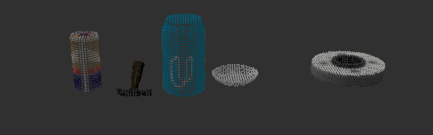
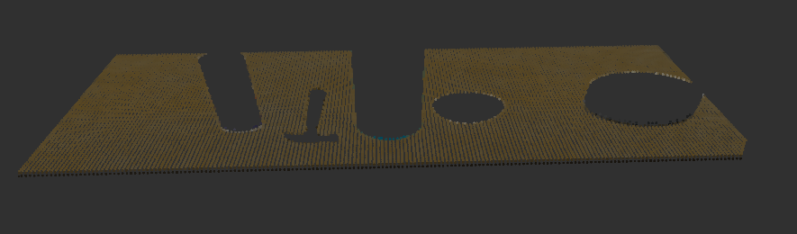
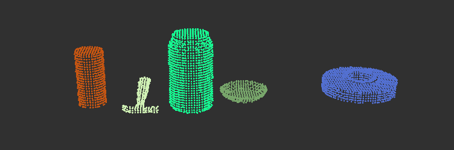
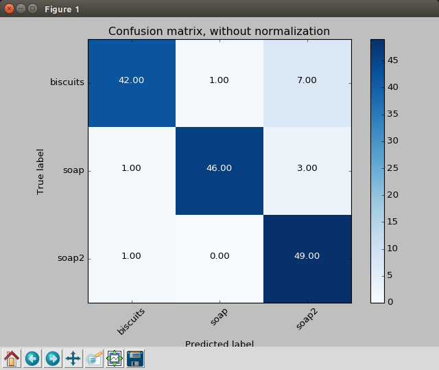
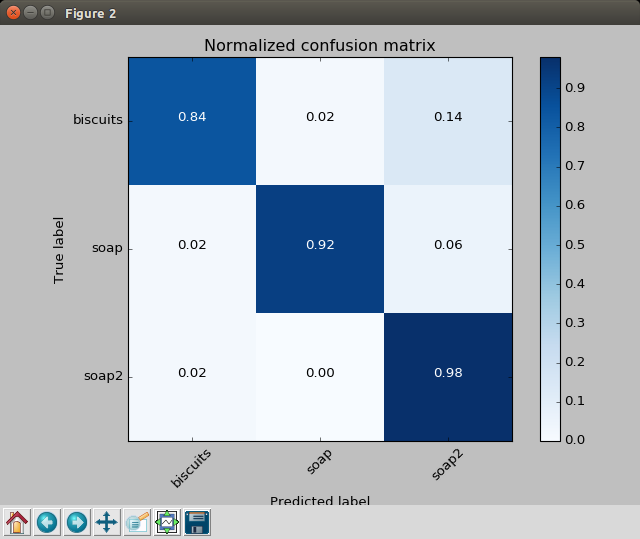
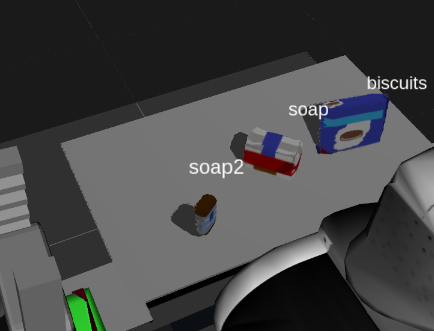
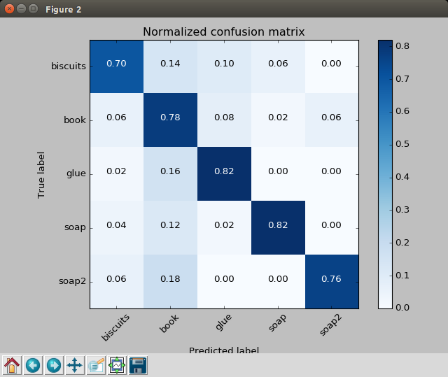
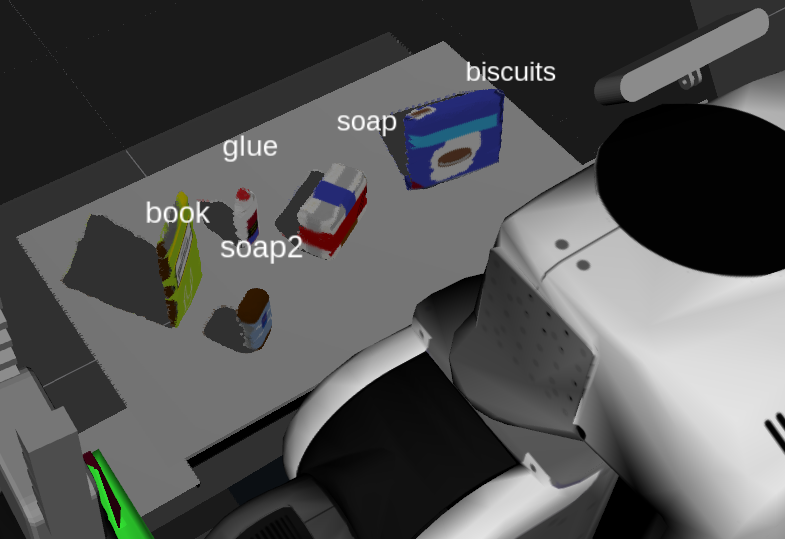
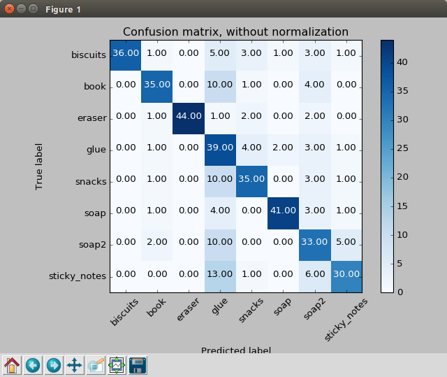
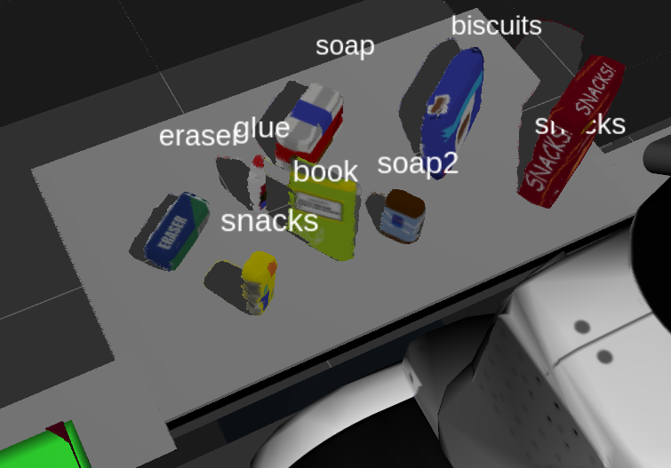

[](https://www.udacity.com/robotics)
# 3D Perception

In this project, you must assimilate your work from previous exercises to successfully complete a tabletop pick and place operation using PR2. The PR2 has been outfitted with an RGB-D sensor much like the one you used in previous exercises. This sensor however is a bit noisy much like real sensors.

Given a cluttered tabletop scenario, you must implement a perception pipeline using your work from Exercises 1, 2 and 3 to identify target objects from a so-called “Pick-List” in a particular order, pick up those objects and place them in corresponding dropboxes.


## Perception Pipeline

### Reading the RGB-D Pointcloud Data

```python
# Create Subscribers
    pcl_sub = rospy.Subscriber("/pr2/world/points", pc2.PointCloud2, pcl_callback, queue_size=1)

```
**pcl_callback** is a callback function, it will trigger the function everytime the sesnor publishes a new **pc2.PointCloud2** message.

### Point Cloud Filtering

#### Statistical Outlier Filtering
First Stage. Remove outlier

```python
# Create a statistical filter object: 
outlier_filter = cloud_filtered.make_statistical_outlier_filter()
# Set the number of neighboring points to analyze for any given point
outlier_filter.set_mean_k(3)
# Set threshold scale factor
x = 0.00001
# Any point with a mean distance larger than global (mean distance+x*std_dev)
# will be considered outlier
outlier_filter.set_std_dev_mul_thresh(x)
# Call the filter function
cloud_filtered = outlier_filter.filter()
```

#### Voxel Grid Down sampling
Second stage. To remove point cloud that is not within the region of interest.

```python
# Create a VoxelGrid filter object for our input point cloud
vox = cloud_filtered.make_voxel_grid_filter()
# Choose a voxel (also known as leaf) size 
# Experiment and find the appropriate size!
LEAF_SIZE = 0.005  
# Set the voxel (or leaf) size  
vox.set_leaf_size(LEAF_SIZE, LEAF_SIZE, LEAF_SIZE)
# Call the filter function to obtain the resultant downsampled point cloud
cloud_filtered = vox.filter()
```

#### Pass Through filter
Third stage. Crop the region of interest.

```python
# Create a PassThrough filter object.
passthrough = cloud_filtered.make_passthrough_filter()
# Assign axis and range to the passthrough filter object.
filter_axis = 'z'
passthrough.set_filter_field_name(filter_axis)
axis_min = 0.6095
axis_max = 1.1
passthrough.set_filter_limits(axis_min, axis_max)
# Use the filter function to obtain the resultant point cloud. 
cloud_filtered = passthrough.filter()
```

### RANSAC Plane Segmentation
To segment the table top and the objects

```python
# Create the segmentation object
seg = cloud_filtered.make_segmenter()
# Set the model you wish to fit 
seg.set_model_type(pcl.SACMODEL_PLANE)
seg.set_method_type(pcl.SAC_RANSAC)
# Max distance for a point to be considered fitting the model
# Experiment with different values for max_distance 
# for segmenting the table
max_distance = 0.006
seg.set_distance_threshold(max_distance)
# Call the segment function to obtain set of inlier indices and model coefficients
inliers, coefficients = seg.segment()
# Extract inliers (Table)
extracted_table   = cloud_filtered.extract(inliers, negative=False)
# Extract outliers (Tabletop Objects)
extracted_objects = cloud_filtered.extract(inliers, negative=True)
```





### Euclidean Clustering
Segment the different objects




## Object Recognition in 3 worlds

### Test 1 - Training

* Features in Training Set: 150
* Invalid Features in Training set: 0
* Scores: [ 0.86666667  0.96666667  0.96666667  0.9         0.86666667]
* Accuracy: 0.91 (+/- 0.09)
* accuracy score: 0.913333333333





* Detected result : 3/3

### Test 2 - Training

* Features in Training Set: 250
* Invalid Features in Training set: 0
* Scores: [ 0.86  0.8   0.68  0.7   0.84]
* Accuracy: 0.78 (+/- 0.15)
* accuracy score: 0.776





* Detected result : 5/5

### Test 3 - Training

* Features in Training Set: 400
* Invalid Features in Training set: 0
* Scores: [ 0.675   0.6625  0.775   0.75    0.8   ]
* Accuracy: 0.73 (+/- 0.11)
* accuracy score: 0.7325





* Detected result : 7/8
* sticks note is identified as snacks

## Results yaml files:

[**output_1.yaml**](./data/output_1.yaml)

[**output_2.yaml**](./data/output_2.yaml)

[**output_3.yaml**](./data/output_3.yaml)